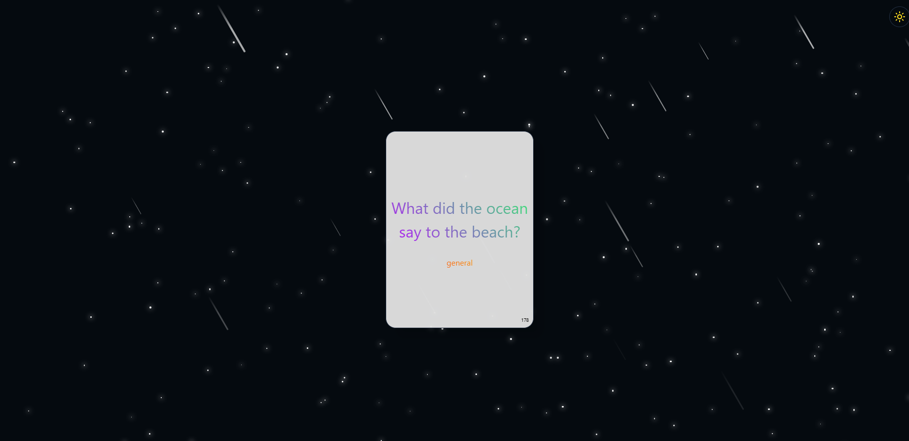

# React + Vite + Tailwindcss + localforage (Database) + JavaScript ✨

Please make sure to quickly click darkmode / lightmode toggle top right as soon as the webpage loads. 
This is to prevent eyes burning but also has a meteor shower with stars darkmode theme ONLY. 
All animated ✨.

Due to the use of a database but also wanting to keep things simple.. ✨
I went with **localforage** as this creates a database at runtime and is stored on the browser, a small 180kbs.
But then it is destroyed when leaving the webpage. (according to my browser).
Without the use of extra files and extra steps to get it installed and working.

# How to run ✨
- Clone repo
- Open Terminal **CMD** in project.
- Type " npm install && npm run dev "
  IF the top causes issues.
  Type " npm install " when that is done " npm run dev "
- A URL will display in the Terminal after " npm run dev " CTRL and click on the link.

jokes.json is the index.json from [**__Github__**](https://github.com/15Dkatz/official_joke_api/blob/master/jokes/index.json)

